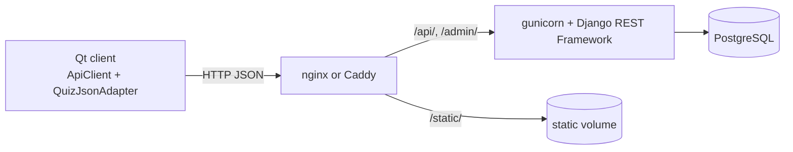

# Quiz API: Django → Docker → Qt

[Русский](README.md) · **English**

[](https://github.com/EDeev/quizlab/actions/workflows/ci.yml)
[](https://github.com/EDeev/quizlab/releases)

Three software architecture labs built around one application: a quiz REST API on Django REST Framework,
the same API in Docker with four deployment options, and a C++/Qt desktop client using the Singleton and
Adapter patterns.

**Status:** coursework ("Software Systems Architecture", Moscow Polytechnic University, group 241-327,
spring 2026), completed


**Stack:** Python · Django · Django REST Framework · PostgreSQL · Docker Compose · nginx · Caddy ·
C++17 · Qt 6 (Widgets, Network) · CMake

## Labs

| | What was built | Folder |
|---|---|---|
| 1 | REST API: `Quiz` model, serializer, `ModelViewSet`, Faker test data generator, PostgreSQL | [`lab-1/`](lab-1) |
| 2 | The API in containers: gunicorn behind nginx, static files from a shared volume, own images in the `git.deev.su` registry | [`lab-2/`](lab-2) |
| 3 | Desktop client for the API: five HTTP methods, table and text views, Singleton and Adapter | [`lab-3/`](lab-3) |

Deployment options in the second lab:

| Folder | Images | PostgreSQL |
|---|---|---|
| `local/` | built from source | in a container |
| `web_pg/` | prebuilt `git.deev.su/deevev/quizlab` | in a container |
| `web_lite/` | prebuilt `git.deev.su/deevev/quizlab` | external |
| `caddy/` | built from source, Caddy instead of nginx, HTTPS with a self-signed certificate | in a container |

## How it works



API: `GET /api/quiz/`, `GET /api/quiz/<id>/`, `POST /api/quiz/`, `PUT /api/quiz/<id>/`,
`DELETE /api/quiz/<id>/`. Quiz fields: title, description, author, time limit in minutes, published flag,
creation date.

In the client, `ApiClient` is a Meyers singleton: one `QNetworkAccessManager` for the whole app.
`QuizJsonAdapter` implements `IQuizAdapter` and turns a `QJsonObject` into a `Quiz`, so the window works
with a domain class rather than JSON.

## Running

The API in Docker (built from source, PostgreSQL in a container, 100 quizzes generated on start):

```bash
cd lab-2/local
cp .env.example .env      # set the DB password and DJANGO_SECRET_KEY
docker compose up -d      # API at http://localhost/api/quiz/
```

The other options run the same way from their folders. For `caddy/`, run `sh gen-cert.sh` first; the site
opens at `https://localhost`.

A prebuilt client is in the [releases](https://github.com/EDeev/quizlab/releases/latest): `quizlab-client-windows-x64.zip`
(unpack and run `quizlab-client.exe`) and `quizlab-client-linux-x86_64.AppImage` (`chmod +x` and run).

Building the client from source (needs Qt 6 and CMake):

```bash
cd lab-3
cmake -B build && cmake --build build
./build/lab-3             # API defaults to http://localhost:80; another address: QUIZ_API_URL=http://host:port
```

The first lab without Docker: PostgreSQL, then `pip install -r lab-1/requirements.txt`,
`python manage.py migrate`, `python manage.py runserver`. The connection is set with `POSTGRES_*`
variables; Django settings with `DJANGO_SECRET_KEY`, `DJANGO_DEBUG`, `DJANGO_ALLOWED_HOSTS`.

## Screenshots

| DRF browsable API | Client text view |
|---|---|
|  |  |

## Development

Each lab is a self-contained folder, so the Django project is repeated in `lab-1/`, `lab-2/local/backend/`
and `lab-2/caddy/backend/`. The `http.restbook` files are API requests for the REST Book extension in
VS Code.

## License

Coursework ("Software Systems Architecture", Moscow Polytechnic University, 2026). The code is open for
study; there is no separate license.

## Author

**Egor Deev** — [GitHub](https://github.com/EDeev) · [Telegram](https://t.me/DeevEgor) · [egor@deev.space](mailto:egor@deev.space)

---

<div align="center">
  <sub>⭐ If you find this project useful, give it a star!</sub>
  <p><sub>Made with ❤️ — <a href="https://deev.space">deev.space</a></sub></p>
</div>
