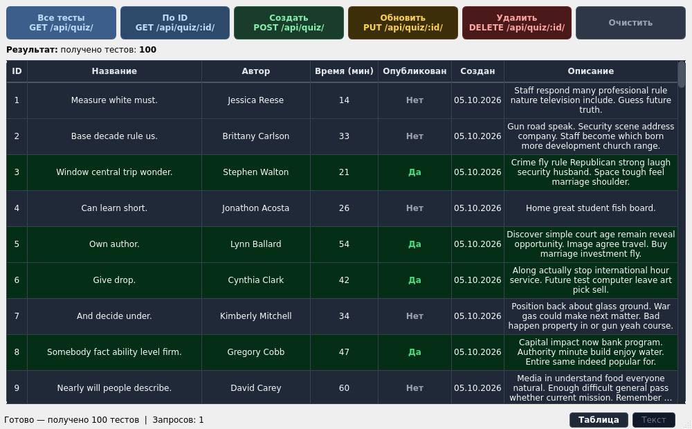
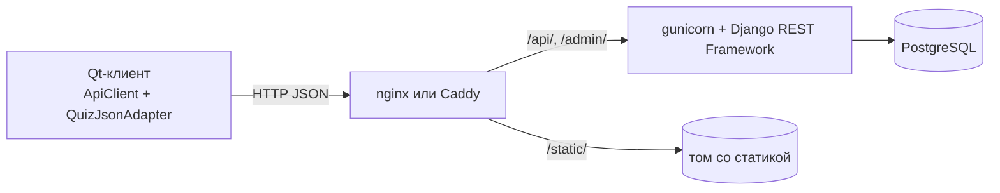
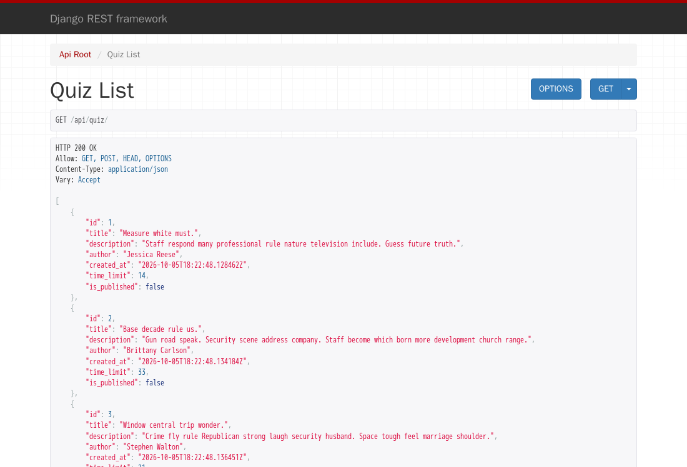
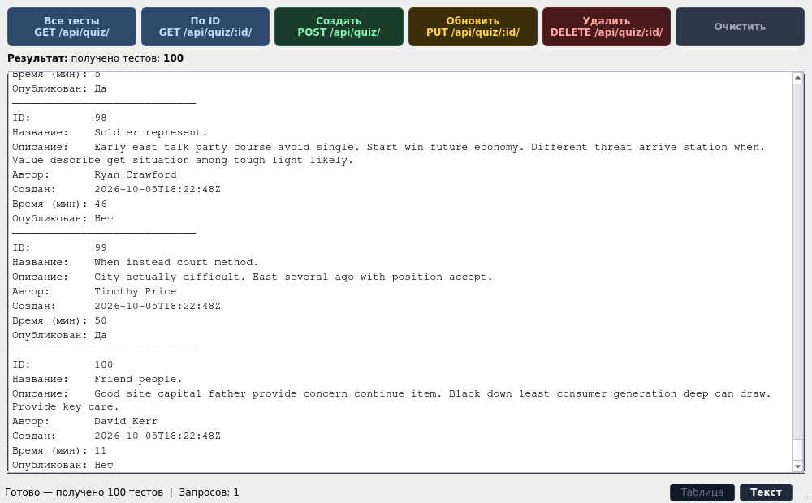

# Quiz API: Django → Docker → Qt

**Русский** · [English](README.en.md)

Три лабораторные по архитектуре программных систем, построенные вокруг одного приложения. Сначала
REST API викторин на Django REST Framework, затем то же API в Docker в четырёх вариантах развёртывания,
затем десктопный клиент на C++/Qt с паттернами Singleton и Adapter.

**Статус:** учебный проект («Архитектура программных систем», Московский Политех, группа 241-327,
весна 2026), завершён



**Стек:** Python · Django · Django REST Framework · PostgreSQL · Docker Compose · nginx · Caddy ·
C++17 · Qt 6 (Widgets, Network) · CMake

## Лабораторные

| | Что сделано | Папка |
|---|---|---|
| 1 | REST API: модель `Quiz`, сериализатор, `ModelViewSet`, генератор тестовых данных на Faker, PostgreSQL | [`lab-1/`](lab-1) |
| 2 | API в контейнерах: gunicorn за nginx, статика из общего тома, свои образы в реестре `git.deev.su` | [`lab-2/`](lab-2) |
| 3 | Десктопный клиент к API: пять HTTP-методов, таблица и текстовый вид, Singleton и Adapter | [`lab-3/`](lab-3) |

Варианты развёртывания во второй лабораторной:

| Папка | Образы | PostgreSQL |
|---|---|---|
| `local/` | собираются из исходников | в контейнере |
| `web_pg/` | готовые из `git.deev.su/deevev/quizlab` | в контейнере |
| `web_lite/` | готовые из `git.deev.su/deevev/quizlab` | внешний |
| `caddy/` | собираются из исходников, Caddy вместо nginx, HTTPS с самоподписанным сертификатом | в контейнере |

## Как устроено



API: `GET /api/quiz/`, `GET /api/quiz/<id>/`, `POST /api/quiz/`, `PUT /api/quiz/<id>/`,
`DELETE /api/quiz/<id>/`. Поля теста: название, описание, автор, лимит времени в минутах, опубликован
ли, дата создания.

В клиенте `ApiClient` — синглтон Мейерса: одно соединение `QNetworkAccessManager` на всё приложение.
`QuizJsonAdapter` реализует интерфейс `IQuizAdapter` и переводит `QJsonObject` в `Quiz`, поэтому окно
работает с классом предметной области, а не с JSON.

## Запуск

API в Docker (сборка из исходников, PostgreSQL в контейнере, 100 тестов генерируются при старте):

```bash
cd lab-2/local
cp .env.example .env      # задайте пароль БД и DJANGO_SECRET_KEY
docker compose up -d      # API на http://localhost/api/quiz/
```

Остальные варианты запускаются так же из своих папок. Для `caddy/` сначала выполните `sh gen-cert.sh`,
сайт откроется на `https://localhost`.

Клиент (нужны Qt 6 и CMake):

```bash
cd lab-3
cmake -B build && cmake --build build
./build/lab-3             # API по умолчанию — http://localhost:80, другой адрес: QUIZ_API_URL=http://host:port
```

Первая лабораторная без Docker: PostgreSQL, затем `pip install -r lab-1/requirements.txt`,
`python manage.py migrate`, `python manage.py runserver`. Подключение задаётся переменными `POSTGRES_*`,
настройки Django — `DJANGO_SECRET_KEY`, `DJANGO_DEBUG`, `DJANGO_ALLOWED_HOSTS`.

## Как выглядит

| Браузерный API DRF | Текстовый вид клиента |
|---|---|
|  |  |

## Разработка

Каждая лабораторная — самостоятельная папка, поэтому Django-проект повторяется в `lab-1/`,
`lab-2/local/backend/` и `lab-2/caddy/backend/`. Файлы `http.restbook` — запросы к API для расширения
REST Book в VS Code.

## Лицензия

Учебный проект («Архитектура программных систем», Московский Политех, 2026). Код открыт для изучения,
отдельной лицензии нет.

## Автор

**Деев Егор Викторович** — [GitHub](https://github.com/EDeev) · [Telegram](https://t.me/DeevEgor) · [egor@deev.space](mailto:egor@deev.space)

---

<div align="center">
  <sub>⭐ Если проект оказался полезным, поставьте звёздочку!</sub>
  <p><sub>Сделано с ❤️ — <a href="https://deev.space">deev.space</a></sub></p>
</div>
